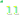
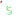

# 👋 Jesus Fernández Machín

I'm a software developer from Venezuela based in Santiago, Chile, passionate about building tools that empower educators, streamline operations, and simplify complex workflows. I specialize in SaaS platforms across education, e-commerce, internal tools, APIs & integrations, and custom web applications.

---

## 🚀 What I’m Working On

| Project         | Description                                                  | Tech Stack                    | Status                                    | Link                                 |
| --------------- | ------------------------------------------------------------ | ----------------------------- | ----------------------------------------- | ------------------------------------ |
| EduPro360       | School-management SaaS tailored to Venezuelan curricula and workflows | Laravel, Node.js, MariaDB, Tailwind |  | *(private repo)* |
| Condo360        | End-to-end condominium management platform                   | Laravel, MariaDB, Tailwind      |          | *(private repo)* |
| FitAdminX       | Administrative and fitness platform for gyms                 | Node.js, Vue.js, MongoDB        |                 | *(private repo)* |
| Seduc Servicios 2.0 | Streamlining educational administration in Chile        | PHP, MySQL, AWS               |                      | [dev.seduc.cl](https://dev.seduc.cl) |

- Powering backends with **Node.js** & **Express**  
- Crafting high-performance PHP applications in **Laravel**

---

## 🛠️ Tech Stack

**Backend:** PHP, Laravel, Node.js, Python  
**Frontend:** Tailwind CSS, Bootstrap, VueJs, React
**Databases:** MySQL, PostgreSQL, MariaDB  
**Testing:** PHPUnit, Jest, JMeter
**Monitoring:** Datadog, Grafana  
**DevOps & Cloud:** Docker, GitHub Actions, AWS (EC2, S3, RDS)

---

## 🎓 Certifications

- ⏳ Google Project Management Professional Certificate _(in progress, expected Q4 2025)_  
- ⏳ AWS Certified Solutions Architect – Associate _(in progress, expected Q1 2026)_

---

## 🎯 Goals

- Master design patterns and SOLID principles in Node.js, Express, and Laravel  
- Architect fault-tolerant, microservices-ready APIs  
- Optimize cloud costs while ensuring high availability

---

## 💻 I Code With

  
  
  
  
  
  
  
  
  
  

---

## 📊 My Statistics

  
  
  
  
  
  
  

---

## 📈 GitHub Activity

  

---

## 📫 How to Reach Me

  
  
  
  
  
  
  

---

## 🎵 Fun Facts

- 🥁 When I'm not coding, I play percussion instruments or strategize in games like Minecraft and Age of Empires.
- 🎬 I love binge-watching superhero series and movies—especially from the Marvel and DC universes.
